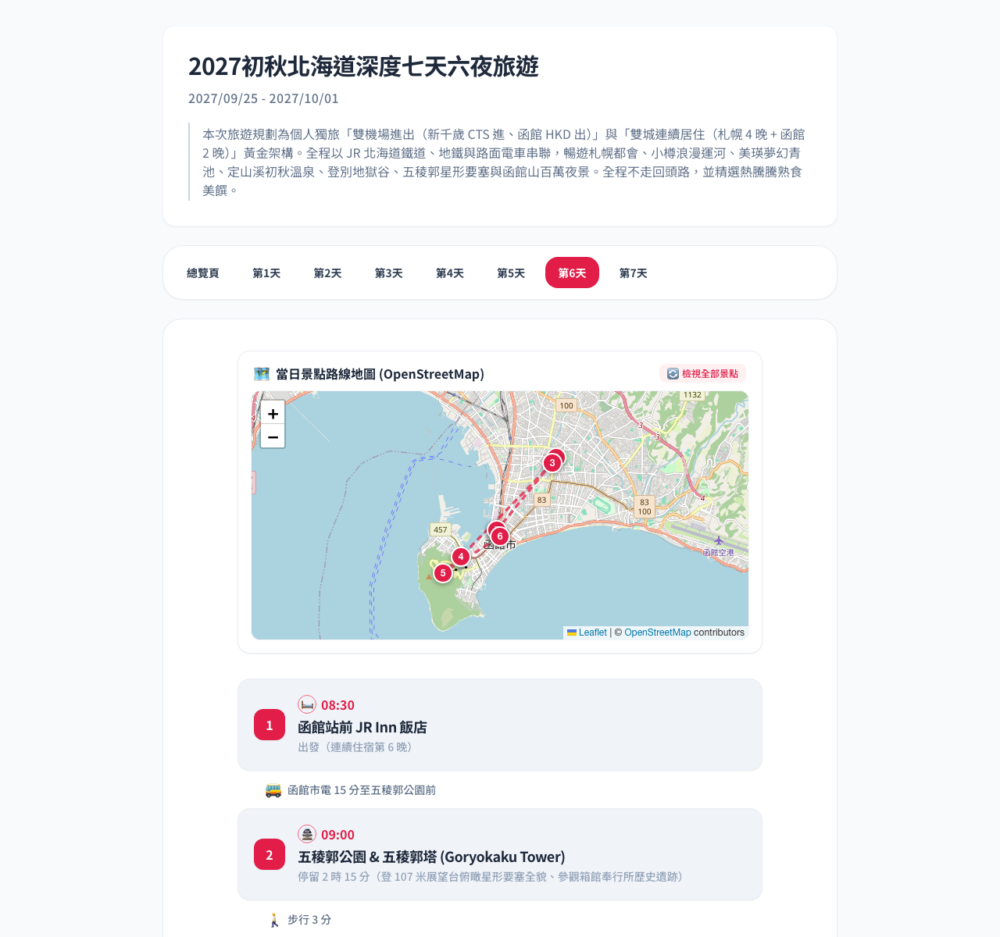
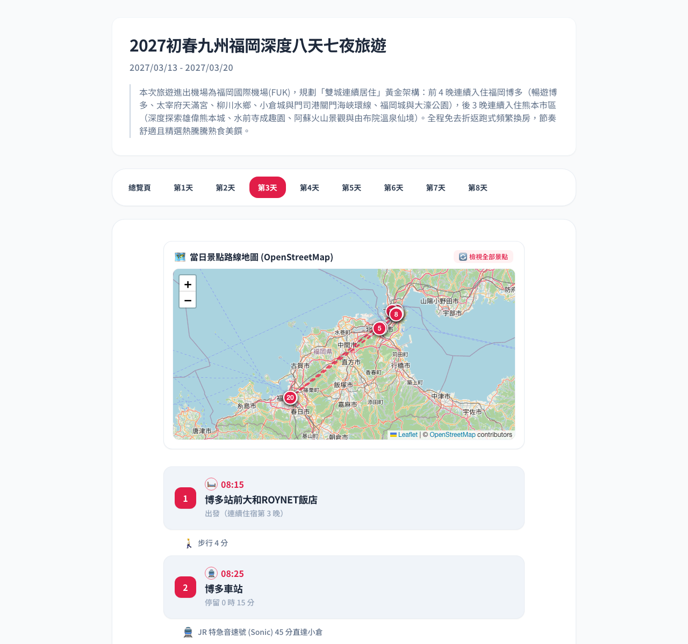
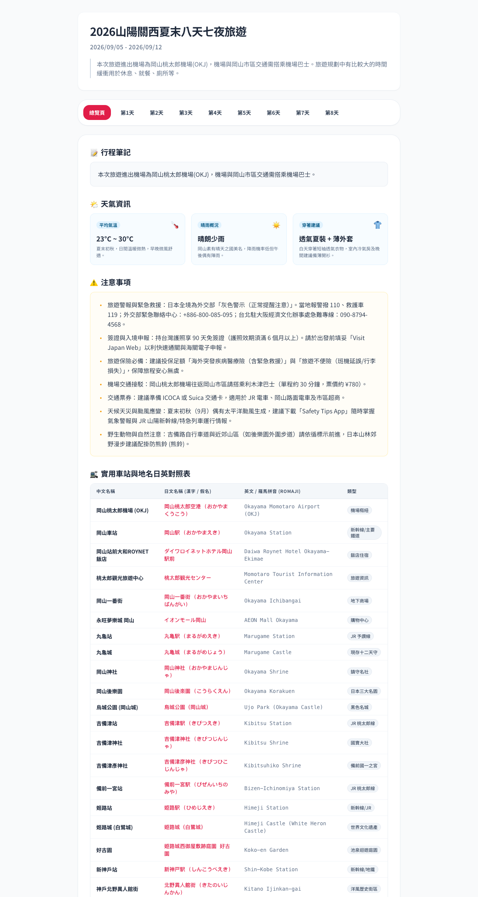

# TripCraft

[繁體中文](./README.zh-TW.md)

TripCraft is a portable, research-driven travel-planning skill for coding agents and browser-based AI assistants. It turns a user-led conversation into a verified, standalone interactive itinerary.

## Language-aware planning

TripCraft uses the language of the first substantive travel-planning request and keeps it for the entire planning flow and generated HTML. Traditional Chinese, Simplified Chinese, Japanese, and English are supported directly; a later explicit language request changes subsequent output. If the first request is genuinely mixed or unclear, TripCraft asks one short language question before planning.

Proper names, official spellings, route identifiers, sources, and the intentional multilingual place/station table remain in their useful native forms. All surrounding prose and UI labels follow the selected output language.

## Template previews

The standalone HTML templates use Vue 3, Tailwind CSS, and bidirectional OpenStreetMap/Leaflet interactions. They open on an overview page by default.

### Hokkaido: 7 days, Sapporo to Hakodate

| Overview | Daily itinerary and map |
| :---: | :---: |
|  |  |

### Kyushu: 8 days, Hakata to Kumamoto

| Overview | Daily itinerary and Kanmon Strait route map |
| :---: | :---: |
|  |  |

### Additional examples

| Kansai deep revisit | Okayama, Sanyo, and Kansai |
| :---: | :---: |
|  |  |

## What TripCraft does

TripCraft is not a generic itinerary generator. Its workflow requires:

1. Origin, domestic/international scope, preferences, duration, and attraction choices before detailed planning.
2. Research-backed destination and attraction recommendations scaled to trip length and pace.
3. Open-Jaw flight evaluation and continuous lodging bases to reduce backtracking and hotel changes.
4. Concrete lodging research with user selection rather than silent defaults.
5. Safety, visa, insurance, baggage-claim, climate, disaster, wildlife, and local-event research.
6. Multimodal transport planning, including exact bike rental/dock research and availability-driven cycling routes.
7. Research-backed visit duration, coordinates, exact-date operating hours, holiday closures, reservations, and backups for uncertain availability.
8. Real transit routes, walking/cycling times, and a 30-minute station waiting/transfer buffer.
9. A day-by-day timeline whose timing is calculated from visits, transit, meals, waits, and contingency time.
10. A complete interactive HTML itinerary with localized UI, a four-section overview, strict one-to-one place references, hash-synced tabs, numbered map markers, and card-to-map interaction.

## Repository layout

```text
TripCraft/
├── README.md                  English project guide
├── README.zh-TW.md            Traditional Chinese project guide
├── SKILL.md                   Coding-agent / CLI skill
├── SKILL-for-Web.md           Browser-AI system prompt with full HTML reference
├── docs/images/               Preview screenshots
└── templates/
    ├── hokkaido-7days.html
    ├── kyushu-8days.html
    ├── kansai-7days.html
    ├── okayama-travel.html
    └── tokyo-8days.html
```

## Choose an integration mode

| Platform | File | Installation or use |
| --- | --- | --- |
| ChatGPT web / GPTs | [`SKILL-for-Web.md`](./SKILL-for-Web.md) | Paste the complete prompt into instructions or the conversation. |
| Gemini Gems | [`SKILL-for-Web.md`](./SKILL-for-Web.md) | Paste the complete prompt into Gem instructions. |
| Claude web | [`SKILL-for-Web.md`](./SKILL-for-Web.md) | Paste the complete prompt into project instructions or the conversation. |
| Claude Code | [`SKILL.md`](./SKILL.md) | Install as `~/.claude/skills/tripcraft/SKILL.md`. |
| Codex CLI | [`SKILL.md`](./SKILL.md) | Install as `~/.codex/skills/tripcraft/SKILL.md`. |
| Google Antigravity | [`SKILL.md`](./SKILL.md) | Install in `<appDataDir>/skills/tripcraft/SKILL.md`. |

The CLI skill can read repository templates directly. The Web prompt embeds a full HTML reference because web assistants cannot read local files.

## Start a trip

Use the language you want TripCraft to use for the conversation and final itinerary.

- English: `Plan an 8-day public-transit trip to Hokkaido from Taipei. I am travelling solo and prefer cooked food.`
- 日本語: `台北から北海道へ8日間旅行したいです。公共交通機関で、一人旅、加熱した料理を中心にしたいです。`
- 繁體中文：`我想規劃日本北海道 8 天 7 夜，台北出發，個人獨旅、熟食為主、大眾運輸。`

TripCraft asks for the remaining information progressively, researches the requested dates and operating constraints, and produces the HTML itinerary after the plan is confirmed.

## Delivered HTML

Each generated file is self-contained and opens directly in a browser. It includes:

- An overview page with trip notes, weather, safety notices, and a one-to-one place/station reference table.
- Text-only pill tabs for the overview and every day, synchronized with URL hashes such as `#overview` and `#day1`.
- Vue 3 + Tailwind CSS with Leaflet/OpenStreetMap from CDNs; no build step.
- Rose numbered markers, dashed route lines, automatic map bounds, reset controls, and card-to-map focus at zoom 17.
- Localized labels and document language for the user's selected output language.
